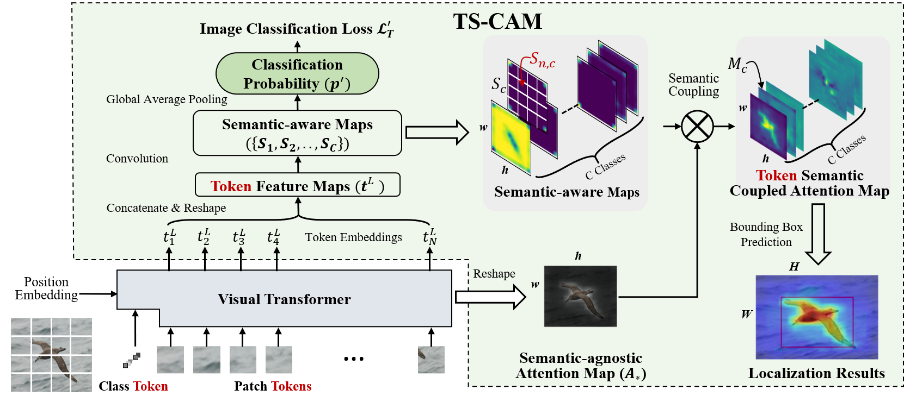
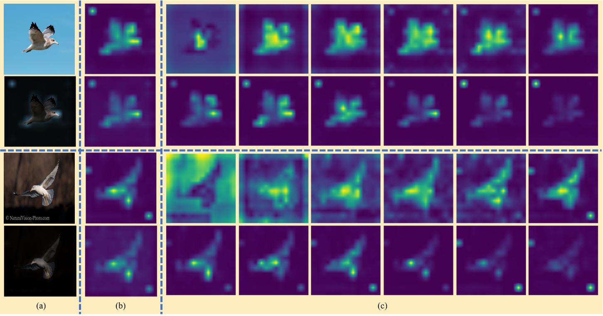

# TS-CAM: Token Semantic Coupled Attention Map for Weakly SupervisedObject Localization

This is the official implementaion of paper [***TS-CAM: Token Semantic Coupled Attention Map for Weakly Supervised
Object Localization***](https://arxiv.org/abs/2103.14862), which is accepted as ***ICCV 2021*** poster.

This repository contains Pytorch training code, evaluation code, pretrained models and jupyter notebook for more
visualization.

## Illustration

Based on Deit, TS-CAM couples attention maps from visual image transformer with semantic-aware maps to obtain accurate
localization maps (Token Semantic Coupled Attention Map, ts-cam).



# Custom image Inference

- Download the
  pre-trained [weights](https://drive.google.com/drive/folders/1vLJhWaRxCOTx_SyvrkP0XDXt9QNCXOdv?usp=sharing)
- use the python script tools_cam/mask_rotation.py

```
bash mask_rotation.py --weights 'path/to/weights.pth' --inference-image 'path/to/image.png' --reference 'path/to/reference.png'
```
example:
```
bash mask_rotation.py --weights '/ts-cam-deit-small/ts-cam-deit-small/ILSVRC2012/model_epoch12.pth' --inference-image 'path/to/image.png' --reference 'path/to/reference.png'
```


# Updates

- (06/07/2021) Higher performance is reported when using stonger visual
  transformer [Conformer](https://arxiv.org/abs/2105.03889).

# Model Zoo

We provide pretrained TS-CAM models trained on CUB-200-2011 and ImageNet_ILSVRC2012 datasets.

## CUB-200-2011 dataset

| Backbone | Loc.Acc@1 | Loc.Acc@5 | Loc.Gt-Known | Cls.Acc@1 | Cls.Acc@5 | Baidu Drive | Google Drive |
| --- | --- | --- | --- | --- | --- | --- | --- |
|  Deit-T   |   64.5   |   80.9  |  86.4  |   72.9  |   91.9  |  [model](https://pan.baidu.com/s/1ui8dk-_U7wUw2JD0K9wOLw)  | [model](https://drive.google.com/drive/folders/1vLJhWaRxCOTx_SyvrkP0XDXt9QNCXOdv?usp=sharing) |
|  Deit-S   |   71.3   |   83.8  |  87.7  |   80.3  |   94.8  |  [model](https://pan.baidu.com/s/1ui8dk-_U7wUw2JD0K9wOLw)  | [model](https://drive.google.com/drive/folders/1vLJhWaRxCOTx_SyvrkP0XDXt9QNCXOdv?usp=sharing) |
|  Deit-B-384   |   75.8   |  84.1   |  86.6  |   86.8  |   96.7  |   [model](https://pan.baidu.com/s/1ui8dk-_U7wUw2JD0K9wOLw)  | [model](https://drive.google.com/drive/folders/1vLJhWaRxCOTx_SyvrkP0XDXt9QNCXOdv?usp=sharing) |
|  Conformer-S   |   77.2   |  90.9   |  94.1  |   81.0  |   95.8  |   [model](https://pan.baidu.com/s/1ui8dk-_U7wUw2JD0K9wOLw)  | [model](https://drive.google.com/drive/folders/1vLJhWaRxCOTx_SyvrkP0XDXt9QNCXOdv?usp=sharing) |

## ILSVRC2012 dataset

| Backbone | Loc.Acc@1 | Loc.Acc@5 | Loc.Gt-Known | Cls.Acc@1 | Cls.Acc@5 | Baidu Drive | Google Drive |
| --- | --- | --- | --- | --- | --- | --- | --- |
|  Deit-S   |   53.4   |  64.3   |  67.6  |   74.3  |   92.1  |   [model](https://pan.baidu.com/s/1ui8dk-_U7wUw2JD0K9wOLw)  | [model](https://drive.google.com/drive/folders/1vLJhWaRxCOTx_SyvrkP0XDXt9QNCXOdv?usp=sharing) |

Note: the Extrate Code for Baidu Drive is [gwg7](https://pan.baidu.com/s/1ui8dk-_U7wUw2JD0K9wOLw)

- On CUB-200-2011 dataset, we train **TS-CAM** on one Titan RTX 2080Ti GPU, with batch-size 128 and learning rate 5e-5,
  respectively.
- On ILSVRC2012 dataset, we train **TS-CAM** on four Titan RTX 2080Ti GPUs, with batch-size 256 and learning rate 5e-4,
  respectively.

# Usage

First clone the repository locally:

```
git clone https://github.com/vasgaowei/TS-CAM.git
```

Then install Pytorch 1.7.0+ and torchvision 0.8.1+
and [pytorch-image-models 0.3.2](https://github.com/rwightman/pytorch-image-models):

```

conda create -n pytorch1.7 python=3.6
conda activate pytorc1.7
conda install anaconda
conda install pytorch==1.7.0 torchvision==0.8.0 torchaudio==0.7.0 cudatoolkit=10.2 -c pytorch
pip install timm==0.3.2
```

## Data preparation

### CUB-200-2011 dataset

Please download and extrate [CUB-200-2011](http://www.vision.caltech.edu/visipedia/CUB-200-2011.html) dataset.

The directory structure is the following:

```
TS-CAM/
  data/
    CUB-200-2011/
      attributes/
      images/
      parts/
      bounding_boxes.txt
      classes.txt
      image_class_labels.txt
      images.txt
      image_sizes.txt
      README
      train_test_split.txt
```

### ImageNet1k

Download [ILSVRC2012](http://image-net.org/) dataset and extract train and val images.

The directory structure is organized as follows:

```
TS-CAM/
  data/
  ImageNet_ILSVRC2012/
    ILSVRC2012_list/
    train/
      n01440764/
        n01440764_18.JPEG
        ...
      n01514859/
        n01514859_1.JPEG
        ...
    val/
      n01440764/
        ILSVRC2012_val_00000293.JPEG
        ...
      n01531178/
        ILSVRC2012_val_00000570.JPEG
        ...
    ILSVRC2012_list/
      train.txt
      val_folder.txt
      val_folder_new.txt
```

And the training and validation data is expected to be in the `train/` folder and `val` folder respectively:

## For training:

On CUB-200-2011 dataset:

```
bash train_val_cub.sh {GPU_ID} ${NET} ${NET_SCALE} ${SIZE}
```

On ImageNet1k dataset:

```
bash train_val_ilsvrc.sh {GPU_ID} ${NET}  ${NET_SCALE} ${SIZE}
```

Please note that pretrained model weights of Deit-tiny, Deit-small and Deit-base on ImageNet-1k model will be downloaded
when you first train you model, so the Internet should be connected.

## For evaluation:

On CUB-200-2011 dataset:

```
bash val_cub.sh {GPU_ID} ${NET} ${NET_SCALE} ${SIZE} ${MODEL_PATH}
```

On ImageNet1k dataset:

```
bash val_ilsvrc.sh {GPU_ID} ${NET} ${NET_SCALE} ${SIZE} ${MODEL_PATH}
```

`GPU_ID` should be specified and multiple GPUs can be used for accelerating training and evaluation.

`NET` shoule be chosen among `deit` and `conformer`.

`NET_SCALE` shoule be chosen among `tiny`, `small` and `base`.

`SIZE` shoule be chosen among `224` and `384`.

`MODEL_PATH` is the path of pretrained model.

# Visualization

We provided `jupyter notebook` in `tools_cam` folder.

```
TS-CAM/
  tools-cam/
    visualization_attention_map_cub.ipynb
    visualization_attention_map_imaget.ipynb
```

Please download pretrained TS-CAM model weights and try more visualzation results((Attention maps using our method
and [Attention Rollout](https://arxiv.org/abs/2005.00928) method)). You can try other interseting images you like to
show the localization map(ts-cams).

## Visualize localization results

We provide some visualization results as follows.


## Visualize attention maps

We can also visualize attention maps from different transformer layers.




# Contacts

If you have any question about our work or this repository, please don't hesitate to contact us by emails.

- [vasgaowei@gmail.com](vasgaowei@gmail.com)
- [qxye@ucas.ac.cn](qxye@ucas.ac.cn)
- [wanfang@ucas.ac.cn](wanfang@ucas.ac.cn)

You can also open an issue under this project.

# Citation

If you use this code for a paper please cite:

```
@InProceedings{Gao_2021_ICCV,
    author    = {Gao, Wei and Wan, Fang and Pan, Xingjia and Peng, Zhiliang and Tian, Qi and Han, Zhenjun and Zhou, Bolei and Ye, Qixiang},
    title     = {TS-CAM: Token Semantic Coupled Attention Map for Weakly Supervised Object Localization},
    booktitle = {Proceedings of the IEEE/CVF International Conference on Computer Vision (ICCV)},
    month     = {October},
    year      = {2021},
    pages     = {2886-2895}
}
```
